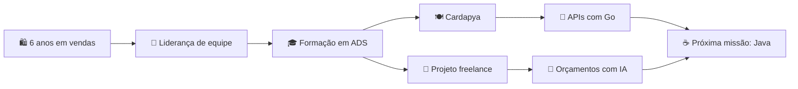

<div align="center">

# Olá, eu sou a Natália! 👋

### Desenvolvedora Júnior | Java, Spring Boot e React

**Vendi por 6 anos. Hoje, construo software.**

Atualmente desenvolvo APIs em Go, integro aplicações com PostgreSQL  
e construo projetos para consolidar minha carreira em desenvolvimento.

[](https://www.linkedin.com/in/gatticabral)
[](https://www.linkedin.com/in/gatticabral/recent-activity/all/)
[](mailto:nataliastephany1@gmail.com)

</div>

---

## Minha virada de carreira 🚀

Antes de escrever código, passei **6 anos trabalhando com vendas e atendimento ao cliente**. Nesse caminho, aprendi a entender problemas, comunicar soluções, trabalhar com metas e liderar pessoas — cheguei a conduzir uma equipe com mais de 10 profissionais.

Hoje levo essa experiência para a tecnologia. Não penso apenas na implementação: procuro entender quem vai usar o produto, qual problema precisa ser resolvido e como transformar essa necessidade em uma solução clara e útil.

Sou formada em **Análise e Desenvolvimento de Sistemas pela PUC Minas** e busco uma oportunidade como **Desenvolvedora Java Júnior**, sem deixar de colocar a mão na massa com Go, React e PostgreSQL nos projetos em que atuo.

## O que estou construindo agora 🛠️

### 🍽️ Cardapya — Desenvolvedora de Software

Atuo no desenvolvimento de soluções reais para o produto:

- construção de APIs com **Go**;
- integração das aplicações com **PostgreSQL**;
- desenvolvimento do front-end das telas de login com **React**.

### 🔧 Software de gestão para oficina — Projeto freelance

Desenvolvo um sistema de gestão para a **Simioni Performance**, incluindo:

- ordens de serviço, cadastro de clientes e módulo financeiro;
- autenticação com **JWT**;
- back-end em **Go**, banco de dados **PostgreSQL** e front-end em **React**;
- módulo em andamento para **geração de orçamentos com IA**, criado a partir de uma necessidade real do cliente.

> Meu projeto favorito é aquele que resolve uma dor que alguém realmente tem.

## Missões em andamento 🎯

- 🤖 Evoluir o módulo de geração de orçamentos com IA para o software da oficina
- 🍽️ Desenvolver e integrar novas soluções na Cardapya
- ☕ Consolidar meus projetos de portfólio com Java e Spring Boot
- ⚙️ Criar automações com n8n a partir de dados comerciais
- 📝 Compartilhar aprendizados e bastidores no meu [Build in Public](https://www.linkedin.com/in/gatticabral/recent-activity/all/)

## Meu inventário real 🧰

<div align="center">


</div>

## Go + Java: dois personagens, uma desenvolvedora ⚔️

<table align="center">
  <tr>
    <td align="center" width="50%">
      <h3>🐹 Go no trabalho</h3>
      APIs, integrações, autenticação<br>
      e soluções para produtos reais.
    </td>
    <td align="center" width="50%">
      <h3>☕ Java na carreira</h3>
      Projetos com Java e Spring Boot<br>
      direcionados à minha próxima oportunidade.
    </td>
  </tr>
</table>

```text
╭────────────────────── GO + JAVA ──────────────────────╮
│                                                       │
│   🐹 experiência prática     +     foco profissional ☕ │
│                                                       │
│          Resultado: soluções que fazem sentido.       │
╰───────────────────────────────────────────────────────╯
```

## Minha jornada 🗺️



## Bastidores sem filtro 📝

Gosto de compartilhar o processo, não apenas o resultado final: decisões, aprendizados, dificuldades e a evolução dos projetos enquanto eles ainda estão sendo construídos.

➡️ **[Acompanhe meus posts de Build in Public no LinkedIn](https://www.linkedin.com/in/gatticabral/recent-activity/all/)**

<details>
  <summary><strong>🎲 Um pouco mais sobre mim</strong></summary>
  <br>

  Minha experiência comercial continua fazendo parte de quem eu sou como desenvolvedora:

  - sei ouvir antes de propor uma solução;
  - consigo traduzir necessidades de negócio em entregas;
  - valorizo comunicação, colaboração e resultado;
  - acredito que tecnologia boa começa entendendo pessoas.

</details>

---

<div align="center">

### Vamos construir algo útil? ✨

[LinkedIn](https://www.linkedin.com/in/gatticabral) • [GitHub](https://github.com/gattidev01) • [E-mail](mailto:nataliastephany1@gmail.com)

`entender o problema → construir → ouvir → melhorar`

</div>
