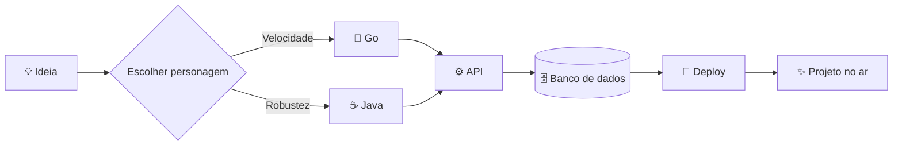

<div align="center">

# Olá, eu sou a Natália! 👾

### Backend developer em uma missão entre Go e Java

`APIs` • `microsserviços` • `código limpo` • `bugs derrotados com café`

[](https://github.com/gattidev01)
[](https://github.com/gattidev01?tab=repositories&q=&type=&language=go)
[](https://github.com/gattidev01?tab=repositories&q=&type=&language=java)

</div>

---

## ⚔️ Escolha seu personagem

<table align="center">
  <tr>
    <td align="center" width="50%">
      <h3>🐹 Gopher</h3>
      <code>rápido • simples • concorrente</code>
      <br><br>
      <strong>Habilidade especial</strong><br>
      Goroutines infinitas<br>
      <br>
      <strong>Frase de batalha</strong><br>
      “Menos mágica, mais clareza.”
    </td>
    <td align="center" width="50%">
      <h3>☕ Java</h3>
      <code>robusto • poderoso • confiável</code>
      <br><br>
      <strong>Habilidade especial</strong><br>
      Spring Boot Supremo<br>
      <br>
      <strong>Frase de batalha</strong><br>
      “Escreva uma vez, debugue em qualquer lugar.”
    </td>
  </tr>
</table>

```text
╭────────────────────── BATALHA BACKEND ──────────────────────╮
│                                                              │
│   🐹 GO              ⚡ VS ⚡                  JAVA ☕        │
│   HP  █████████░░                            ██████████  HP   │
│   ATK ██████████                              ████████░  ATK  │
│   SPD ██████████                              ██████░░░  SPD  │
│                                                              │
│   Resultado: empate técnico. A API ganhou.                   │
╰──────────────────────────────────────────────────────────────╯
```

## 🧑‍💻 Sobre mim

```go
package main

import "fmt"

func main() {
	dev := map[string]any{
		"nome":       "Natália",
		"github":     "gattidev01",
		"foco":       []string{"Go", "Java", "Backend"},
		"combustível": "café + curiosidade",
	}

	fmt.Println("Construindo, aprendendo e evoluindo:", dev)
}
```

```java
public class Natalia {
    private final String mission = "Transformar ideias em software";
    private final String[] arsenal = {"Java", "Go", "APIs", "SQL"};

    public void code() {
        while (true) {
            aprender();
            construir();
            melhorar();
        }
    }
}
```

## 🧰 Meu inventário

<div align="center">


</div>

## 🗺️ Mapa da jornada



## 📊 Status da personagem

<div align="center">


</div>

> Estatísticas são só parte da história. O verdadeiro XP está em cada problema resolvido.

## 🎯 Missões atuais

- [ ] Dominar padrões e boas práticas em Go
- [ ] Evoluir ainda mais no ecossistema Java e Spring
- [ ] Criar APIs rápidas, seguras e bem testadas
- [ ] Transformar café em commits úteis
- [x] Escolher dois ótimos personagens para essa aventura

## 🕹️ Comandos disponíveis

```console
$ whoami
Natália — explorando o universo backend com Go e Java

$ ls interesses/
apis  arquitetura  bancos-de-dados  microsserviços  coisas-divertidas

$ git commit -m "feat: subir de nível"
[main 🚀] experiência adquirida com sucesso

$ sudo deploy-na-sexta
Permissão negada: preserve a paz do fim de semana.
```

<details>
  <summary><strong>🎲 Evento aleatório — clique para abrir</strong></summary>
  <br>

  Você encontrou um bug lendário! 🐛

  Recompensa por derrotá-lo:

  - `+50 XP` em debugging
  - `+20 XP` em paciência
  - `+1` história para contar no próximo café

</details>

---

<div align="center">

### Thanks for visiting! ✨


`while (alive) { learn(); build(); share(); }`

</div>
